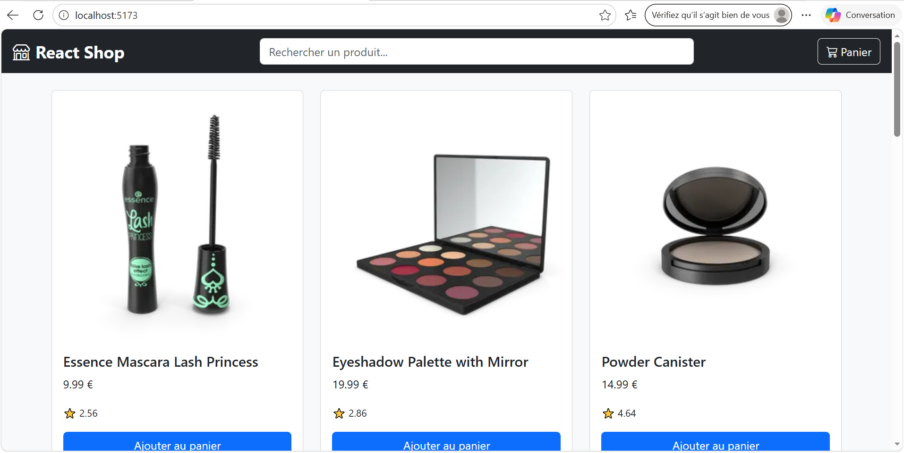
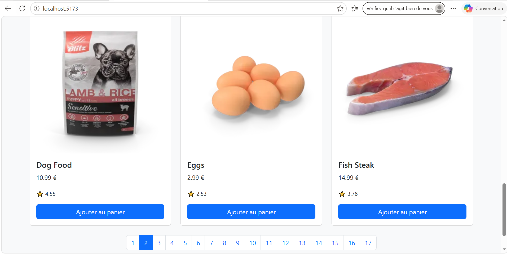
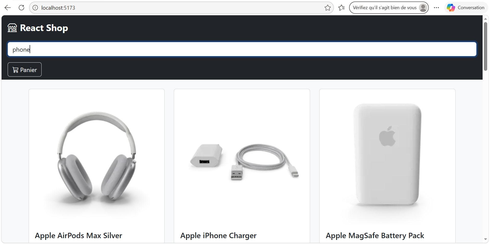
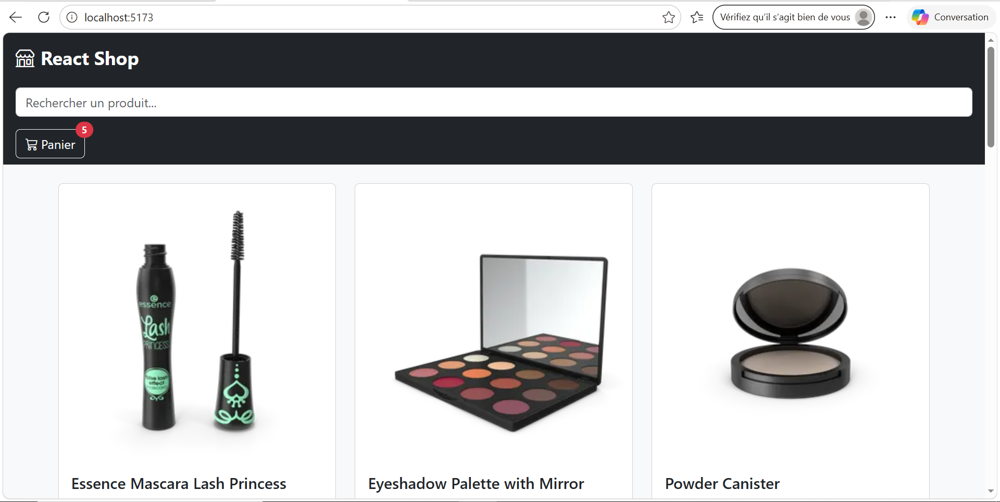
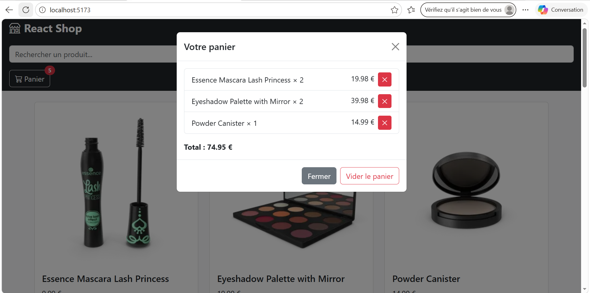
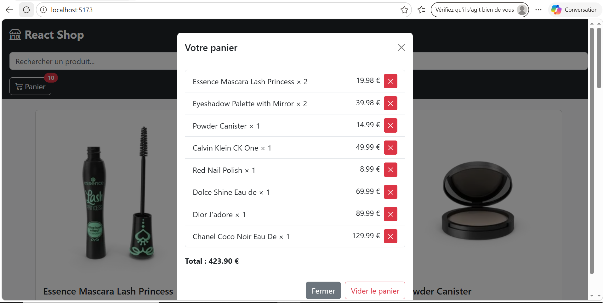

# React Shop — TP Hooks React

Boutique en ligne pédagogique pour mettre en œuvre les hooks React fondamentaux :
`useState` · `useEffect` · `useContext` · `useCallback` · `useMemo` · hooks personnalisés.

---

## Mise en place

### 1. Cloner le dépôt

```bash
git clone https://github.com/<organisation>/react-shop-tp.git
cd react-shop-tp
```

### 2. Installer les dépendances

```bash
npm install
```

### 3. Lancer le serveur de développement

```bash
npm run dev
```

Ouvrir [http://localhost:5173](http://localhost:5173) dans le navigateur.  
Vous devez voir la NavBar « React Shop », une zone principale vide et le Footer.

---

## Restitution du travail

À la fin de chaque étape, effectuer un commit avec le message indiqué.  
À la fin du TP, pousser votre travail sur la branche `main` :

```bash
git push origin main
```

> Pour chaque question ci-dessous, **compléter ce fichier README.md**
> avec votre réponse : capture d'écran, extrait de code ou explication.  
> Remplacer les blocs `<!-- RÉPONSE -->` par votre contenu.

---

## Étape 1 — `useState` : état de l'application

**Fichier à modifier :** `src/App.jsx`

Remplacer les trois variables figées par de vrais appels `useState`, puis câbler
les callbacks `onSearchChange`, `onCartClick`, `onPageChange` et `onClose`.

**Commit :** `step1: wire App state with useState`

---

### Q1.1 — À quoi sert le hook `useState` ?

Expliquer en 2-3 phrases le rôle de `useState` et pourquoi React nécessite ce
hook plutôt qu'une simple variable JavaScript.

<!-- RÉPONSE Q1.1 -->
useState est un hook React qui permet d'ajouter un état local à un composant fonctionnel.
Il retourne un tableau [valeur, setter] : la valeur persiste entre les rendus, et le setter déclenche un nouveau rendu lorsqu’on l’appelle.
Contrairement à une simple variable JavaScript, les changements d’état via useState sont pris en compte par React pour mettre à jour l’interface utilisateur.

---

### Q1.2 — Montrer votre implémentation des trois `useState`

Coller ici l'extrait de code correspondant aux trois déclarations d'état dans `App.jsx`.

```jsx
// RÉPONSE Q1.2 — vos trois useState ici
const [searchQuery, setSearchQuery] = useState('')
const [isCartOpen, setIsCartOpen] = useState(false)
const [page, setPage] = useState(1)

```

---

### Q1.3 — Capture d'écran : la modale s'ouvre et se ferme

Cliquer sur le bouton « Panier » puis sur « Fermer ».  
Joindre une capture montrant la modale ouverte (panier vide).

<!-- RÉPONSE Q1.3 — insérer l'image ci-dessous -->


---

## Étape 2 — Composants `ProductCard` et `ProductList`

**Fichiers à modifier :** `src/components/ProductCard/ProductCard.jsx`  
et `src/components/ProductList/ProductList.jsx`

1. Dans `ProductCard`, câbler le `onClick` du bouton « Ajouter au panier ».
2. Dans `ProductList`, remplacer le texte TODO par la grille Bootstrap de `ProductCard`.

> Pour tester sans l'API, utiliser ces données fictives dans `ProductList` :
>
> ```js
> const products = [
>   { id: 1, title: 'Produit test', price: 9.99, thumbnail: 'https://placehold.co/300x200', rating: 4.5 }
> ]
> ```

**Commit :** `step2: render ProductCard with Add to Cart`

---

### Q2.1 — Qu'est-ce que le « props drilling » ?

Expliquer en 2-3 phrases. Pourquoi pose-t-il problème quand l'arbre de composants est profond ?

<!-- RÉPONSE Q2.1 -->
Le props drilling est le fait de transmettre une propriété à travers plusieurs niveaux de composants intermédiaires qui n’en ont pas besoin, uniquement pour qu’elle arrive au composant final qui l’utilise.
Cela rend le code plus verbeux, moins maintenable et fragilise l’architecture (si un composant intermédiaire est déplacé, la chaîne est cassée).

---

### Q2.2 — Montrer le rendu de la grille

Coller ici la partie JSX du `.map()` dans `ProductList`.

```jsx
// RÉPONSE Q2.2 — votre map ici
{products.map(product => (
  <div className="col" key={product.id}>
    <ProductCard product={product} onAddToCart={addToCart} />
  </div>
))}

```

---

### Q2.3 — Capture d'écran : la grille avec le produit fictif

<!-- RÉPONSE Q2.3 -->


---

## Étape 3 — `useEffect` : chargement des données

**Fichier à modifier :** `src/hooks/useProducts.js`  
et `src/components/ProductList/ProductList.jsx` (brancher le hook + Pagination)

Implémenter `useProducts(searchQuery, page)` qui récupère les produits depuis :

- `https://dummyjson.com/products?limit=12&skip=N` (navigation)
- `https://dummyjson.com/products/search?q=MOT&limit=12&skip=N` (recherche)

**Commit :** `step3: fetch products with useEffect, pagination`

---

### Q3.1 — Pourquoi utiliser `useEffect` pour les appels réseau ?

Expliquer pourquoi on ne peut pas placer un `fetch()` directement dans le corps
du composant (ou du hook). Quel problème cela provoquerait-il ?

<!-- RÉPONSE Q3.1 -->
Placer un fetch() directement dans le corps du composant provoquerait un appel réseau à chaque rendu (y compris lors des changements d’état sans rapport avec les données).
Cela génère des requêtes inutiles, peut créer des boucles infinies (si l’appel modifie l’état, ce qui redéclenche le rendu, donc un nouvel appel).
useEffect permet de contrôler quand l’effet se produit, grâce au tableau de dépendances.
---

### Q3.2 — Quel est le rôle du tableau de dépendances `[searchQuery, page]` ?

Que se passerait-il si ce tableau était vide `[]` ?  
Et si on l'omettait complètement ?

<!-- RÉPONSE Q3.2 -->
Tableau vide [] → l’effet ne s’exécute qu’une seule fois après le premier rendu.

Sans tableau → l’effet s’exécute après chaque rendu (équivalent à componentDidUpdate non contrôlé).

[searchQuery, page] → l’effet se réexécute uniquement quand l’une de ces deux valeurs change (exactement ce qu’on souhaite pour recharger les produits).
---

### Q3.3 — Montrer votre implémentation du `useEffect` dans `useProducts`

```js
// RÉPONSE Q3.3 — votre useEffect ici
useEffect(() => {
  setLoading(true)
  const skip = (page - 1) * LIMIT
  const url = searchQuery
    ? `https://dummyjson.com/products/search?q=${searchQuery}&limit=${LIMIT}&skip=${skip}`
    : `https://dummyjson.com/products?limit=${LIMIT}&skip=${skip}`

  fetch(url)
    .then(res => res.json())
    .then(data => {
      setProducts(data.products)
      setTotal(data.total)
    })
    .finally(() => setLoading(false))
}, [searchQuery, page])
```

---

### Q3.4 — Capture d'écran : les produits s'affichent, la pagination fonctionne

Joindre une capture montrant la page 2 chargée.

<!-- RÉPONSE Q3.4 -->


---

## Étape 4 — Hook personnalisé `useDebounce`

**Fichier à modifier :** `src/hooks/useDebounce.js` et `src/App.jsx`

Implémenter `useDebounce(value, delay)` puis l'utiliser dans `App.jsx` :

```js
const debouncedQuery = useDebounce(searchQuery, 400)
```

Passer `debouncedQuery` (et non `searchQuery`) à `ProductList`.

**Commit :** `step4: add useDebounce custom hook`

---

### Q4.1 — Qu'est-ce que le debounce et pourquoi est-il utile ici ?

Décrire ce qui se passerait sans debounce quand l'utilisateur tape rapidement.

<!-- RÉPONSE Q4.1 -->

Le debounce consiste à retarder l’exécution d’une action jusqu’à ce qu’un certain délai de calme soit passé.
Sans debounce, chaque frappe au clavier déclencherait une requête réseau (ex: "p" → 1 requête, "ph" → 2ème, "pho" → 3ème…).
Avec debounce (400 ms), quand l’utilisateur tape rapidement, seule la dernière requête (après la pause) est envoyée, ce qui évite de surcharger l’API et améliore les performances.

---

### Q4.2 — Quel est le rôle de la fonction de nettoyage (cleanup) retournée par `useEffect` ?

Expliquer pourquoi `return () => clearTimeout(timer)` est indispensable dans ce cas précis.

<!-- RÉPONSE Q4.2 -->

La fonction return () => clearTimeout(timer) annule le timer précédent avant d’en créer un nouveau.
Si on ne nettoyait pas, plusieurs timers s’accumuleraient et exécuteraient tous setDebouncedValue après le délai, ce qui produirait des résultats incohérents et une fuite mémoire.
C’est le mécanisme standard pour gérer les effets asynchrones annulables (timers, aborts de fetch, etc.).

---

### Q4.3 — Montrer votre implémentation complète de `useDebounce`

```js
// RÉPONSE Q4.3 — useDebounce complet
import { useState, useEffect } from 'react'

export function useDebounce(value, delay) {
  const [debouncedValue, setDebouncedValue] = useState(value)

  useEffect(() => {
    const timer = setTimeout(() => {
      setDebouncedValue(value)
    }, delay)

    return () => clearTimeout(timer)
  }, [value, delay])

  return debouncedValue
}
```

---

### Q4.4 — Preuve du debounce dans les DevTools réseau

Ouvrir l'onglet Réseau du navigateur, taper rapidement « phone » lettre par lettre.
Joindre une capture montrant qu'une seule requête est envoyée après la pause.

<!-- RÉPONSE Q4.4 -->


---

## Étape 5 — Hook personnalisé `useCart` : `useCallback` + `useMemo`

**Fichiers à modifier :** `src/hooks/useCart.js` et `src/context/CartContext.jsx`

Implémenter `useCart()` avec :

- `useState` pour l'état du panier (initialisé depuis `localStorage`)
- `useEffect` pour synchroniser le panier vers `localStorage`
- `addToCart`, `removeFromCart`, `clearCart` avec `useCallback`
- `cartCount` et `cartTotal` avec `useMemo`

Puis brancher `useCart()` dans `CartContext.jsx`.

**Commit :** `step5: implement useCart with localStorage`

---

### Q5.1 — Pourquoi utiliser `useCallback` pour `addToCart`, `removeFromCart` et `clearCart` ?

Quel problème survient si ces fonctions sont recréées à chaque rendu ?
En quoi cela est-il particulièrement problématique quand elles sont passées via un contexte ?

<!-- RÉPONSE Q5.1 -->
Sans useCallback, ces fonctions seraient recréées à chaque rendu du composant qui appelle useCart.
Cela poserait deux problèmes :

1.Performance inutile – recréation d’objets identiques.
2.Rendus enfants indésirables – si ces fonctions sont passées via CartContext, tous les composants consommateurs du contexte (NavBar, ProductList, CartModal) seraient re-rendus à chaque changement d’état du panier, car la référence de la fonction change (même si son comportement est identique).
useCallback garantit la stabilité de la référence tant que les dépendances ne changent pas.

---

### Q5.2 — Pourquoi utiliser `useMemo` pour `cartCount` et `cartTotal` ?

Quelle est la différence entre `useMemo` et `useCallback` ?

<!-- RÉPONSE Q5.2 -->
useMemo mémorise le résultat d’un calcul coûteux (ici le calcul du nombre d’articles et du total) et ne le recalcule que lorsque les dépendances (cartItems) changent.
Sans cela, à chaque rendu du panier, on recalculerait la somme, ce qui est inutile.
Différence :

-useCallback mémorise une fonction.
-useMemo mémorise une valeur (résultat de fonction).

---

### Q5.3 — Montrer votre implémentation de `addToCart` avec `useCallback`

Attention : si le produit est déjà dans le panier, incrémenter la quantité plutôt
que d'ajouter un doublon.

```js
// RÉPONSE Q5.3 — addToCart avec useCallback
const addToCart = useCallback((product) => {
  setCartItems(prev => {
    const existing = prev.find(item => item.id === product.id)
    if (existing) {
      return prev.map(item =>
        item.id === product.id
          ? { ...item, quantity: item.quantity + 1 }
          : item
      )
    }
    return [...prev, { ...product, quantity: 1 }]
  })
}, [])
```

---

### Q5.4 — Preuve de la persistance localStorage

Ajouter 2-3 produits, rafraîchir la page (F5), vérifier que le panier est restauré.  
Joindre une capture de l'onglet Application > localStorage dans les DevTools.

<!-- RÉPONSE Q5.4 -->


---

## Étape 6 — `useContext` : consommation du contexte

**Fichiers à modifier :**

- `src/components/NavBar/NavBar.jsx` — badge du panier
- `src/components/ProductList/ProductList.jsx` — `addToCart`
- `src/components/CartModal/CartModal.jsx` — affichage, suppression, vidage

**Commit :** `step6: consume CartContext in components`

---

### Q6.1 — Quel problème `useContext` résout-il par rapport au props drilling ?

Tracer le chemin qu'aurait dû suivre `addToCart` sans contexte (de `App` jusqu'à `ProductCard`).
Comparer avec le chemin avec `useContext`.

<!-- RÉPONSE Q6.1 -->
Sans contexte :
App → ProductList → ProductCard (transmettre addToCart) → ProductCard reçoit la prop.
Pour NavBar : App → NavBar (transmettre cartCount).
Pour CartModal : App → CartModal (transmettre cartItems, remove…).
Tous ces composants intermédiaires (comme ProductList) devraient propager des props qu’ils n’utilisent pas.

Avec useContext :
Les composants consommateurs (NavBar, ProductList, CartModal) appellent directement useCartContext() là où ils en ont besoin.
Plus aucun drilling. C’est plus propre, plus facile à refactoriser.

---

### Q6.2 — Montrer l'appel à `useCartContext()` dans `CartModal`

```jsx
// RÉPONSE Q6.2 — destructuration depuis useCartContext()
const { cartItems, removeFromCart, clearCart, cartTotal } = useCartContext()

```

---

### Q6.3 — Montrer le rendu d'un article dans la liste du panier

Coller ici le JSX d'un `<li>` de la liste, avec le titre, la quantité, le prix et le bouton supprimer.

```jsx
// RÉPONSE Q6.3 — JSX d'un article du panier
{cartItems.map(item => (
  <li key={item.id} className="list-group-item d-flex justify-content-between align-items-center">
    <span>{item.title} × {item.quantity}</span>
    <span>
      {(item.price * item.quantity).toFixed(2)} €
      <button className="btn btn-sm btn-danger ms-2" onClick={() => removeFromCart(item.id)}>✕</button>
    </span>
  </li>
))}

```

---

### Q6.4 — Capture d'écran : panier fonctionnel

Ajouter au moins 2 produits différents (dont un en double), ouvrir la modale.  
Joindre une capture montrant : le badge correct sur le bouton, les articles listés
avec leurs quantités et le total affiché.

<!-- RÉPONSE Q6.4 -->


---

## Étape 7 — Finitions et vérifications

Vérifier l'ensemble des fonctionnalités et soigner les cas limites.

**Commit :** `step7: polish and final verification`

---

### Checklist finale

Cocher chaque case après vérification :

- [x] La recherche est débouchée (une seule requête après 400 ms de pause)
- [x] La pagination fonctionne en mode navigation (sans recherche)
- [x] Ajouter le même produit deux fois → la quantité s'incrémente (pas de doublon)
- [x] Le panier est restauré après rafraîchissement de la page (F5)
- [x] Le badge de la NavBar affiche le nombre total d'articles correct
- [x] La suppression d'un article met à jour le badge et le total
- [x] « Vider le panier » vide la liste et le localStorage
- [x] Le total affiché dans la modale est correct

---

### Q7.1 — Bilan : quel hook vous a semblé le plus difficile à comprendre et pourquoi ?

<!-- RÉPONSE Q7.1 -->

Le hook le plus difficile à comprendre initialement était useCallback car il ne change pas le comportement visible de l’application, mais agit sur la performance et la stabilité des références.
Il a fallu comprendre la notion de fermeture (closure) et d’égalité référentielle pour saisir pourquoi une fonction non stabilisée peut causer des rendus superflus dans les composants enfants ou dans le contexte.

---

### Q7.2 — Capture d'écran finale

Joindre une capture de l'application complète et fonctionnelle (grille de produits visible,
badge du panier non nul).

<!-- RÉPONSE Q7.2 -->


---

## Référence rapide des hooks utilisés

| Hook | Fichier(s) | Rôle |
| --- | --- | --- |
| `useState` | `App.jsx`, `useProducts.js`, `useCart.js`, `useDebounce.js` | Gérer les états locaux |
| `useEffect` | `useProducts.js`, `useCart.js`, `useDebounce.js` | Effets de bord (fetch, localStorage, timer) |
| `useContext` | `NavBar.jsx`, `ProductList.jsx`, `CartModal.jsx` | Consommer le contexte panier |
| `useCallback` | `useCart.js` | Mémoriser les fonctions du panier |
| `useMemo` | `useCart.js` | Calculer `cartCount` et `cartTotal` |

## Ressources

- [Documentation React — Hooks](https://react.dev/reference/react)
- [API dummyjson.com/products](https://dummyjson.com/docs/products)
- [Bootstrap 5](https://getbootstrap.com/docs/5.3/)
- [Bootstrap Icons](https://icons.getbootstrap.com/)
